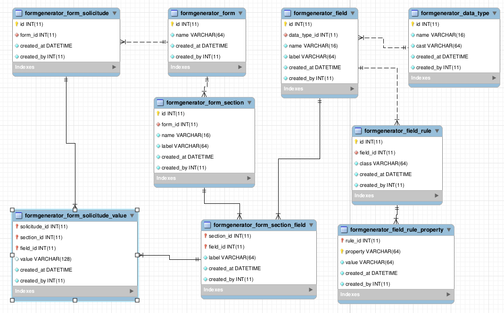

Tecnocen Form Generator
=======================

Library to dynamically generate forms in database.

Instalation
-----------

You can use composer to install the library `tecnocen/yii2-formgenerator` by running
the command;

`composer require tecnocen/yii2-formgenerator`

or edit the `composer.json` file

```json
require: {
    "tecnocen/yii2-formgenerator": "*",
}
```

Then run the required migrations

`php yii migrate/up -p=@tecnocen/formgenerator/migrations`

Which will install the following table structure




ROA Version
-----------

The ROA support is very simple and can be done by just adding a module version
to the api container which will be used to hold the resources.

```php
class Api extends \tecnocen\roa\modules\ApiContainer
{
   $versions = [
       // other versions
       'fg1' => ['class' => 'tecnocen\formgenerator\roa\modules\Version'],
   ];
}
```

You can then access the module to check the available resources.

- data-type
- field
- field/<field_id:\d+>/rule
- field/<field_id:\d+>/rule/<rule_id:\d+>/property
- form
- form/<form_id:\d+>/section
- form/<form_id:\d+>/section/<section_id:\d+>/field
- form/<form_id:\d+>/solicitude
- form/<form_id:\d+>/solicitude/<solicitude_id:\d+>/value

Which will implement CRUD functionalities for a formgenerator.

Alternatively you can add the resource routes to your existing version.
